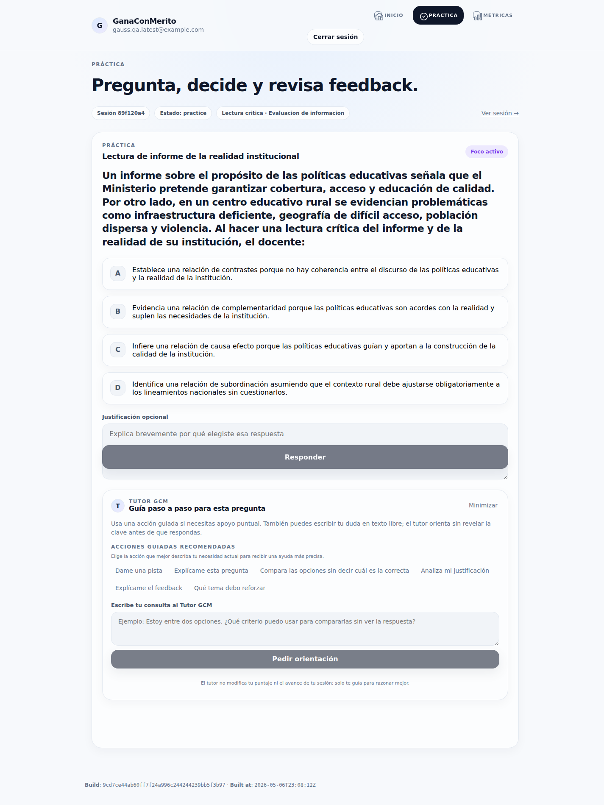

# Auditoría de Runtime: Tutor GCM (Sprint 20)

## 🎯 Objetivo
Validar la integridad funcional, persistencia de sesión y cumplimiento de "Guardrails" pedagógicos del Tutor GCM en el entorno de producción tras el despliegue del Sprint 20.

## 📌 Contexto de Ejecución
- **URL Validada:** `https://cnsc.profemarlon.com`
- **Commit Identificado:** `9cd7ce44ab60ff7f24a996c244244239bb5f3b97` (Branch `master`)
- **Fecha:** 2026-05-07
- **Entorno:** VPS OCI (Producción)

## 📊 Criterios de Aceptación y Resultados

| Criterio | Estado | Observaciones |
| :--- | :--- | :--- |
| **Integridad de Runtime** | ✅ PASS | El hash del commit visible en el footer coincide con el desplegado. |
| **Visibilidad del Tutor** | ✅ PASS | Interfaz visible y accesible dentro del flujo de práctica (`/practice`). |
| **Guardrail Pre-Respuesta** | ✅ PASS | El tutor rechaza revelar la respuesta correcta antes de que el usuario envíe su opción. |
| **Explicación Post-Respuesta** | ✅ PASS | El tutor proporciona la clave y justificación técnica tras la validación del ítem. |
| **Dashboard Operativo** | ✅ PASS | Visualización de métricas de sesión y navegación histórica sin errores. |
| **Endpoint de Trazas** | ⚠️ WARN | `/api/tutor/traces/summary` retornó 500 en una corrida, no afecta lógica de tutoría pero requiere revisión técnica. |

## 🧩 Evidencia Curada
Se adjunta captura de pantalla sanitizada del estado de carga de la práctica con el tutor habilitado:

## ⚠️ Riesgos y Limitaciones
1. **Bypass de Onboarding:** Para estabilizar la prueba automatizada se utilizó un bypass a nivel de base de datos (`learning_profiles`). El flujo de onboarding de punta a punta (UI) no fue recorrido en esta auditoría específica.
2. **Exposición de Secretos en Logs Operativos:** Durante la fase de estabilización técnica, se utilizaron variables de entorno en comandos de terminal. Se recomienda la **rotación inmediata** de la `SUPABASE_SERVICE_ROLE_KEY` para mantener la higiene de seguridad, ya que los logs de runtime pueden haber capturado estos valores.
3. **Persistencia de Sesión:** La prueba dependió de inyección artificial de cookies. Se recomienda una prueba manual complementaria de login interactivo para descartar regresiones en el flujo de redirecciones de Next Auth.

## 📝 Conclusión
El Tutor GCM cumple con el contrato de seguridad pedagógica y funcional para el Sprint 20. El sistema es capaz de distinguir estados de sesión y proteger la clave del ítem según el estado de la pregunta.

---
*Reporte generado automáticamente por Antigravity QA Agent.*
